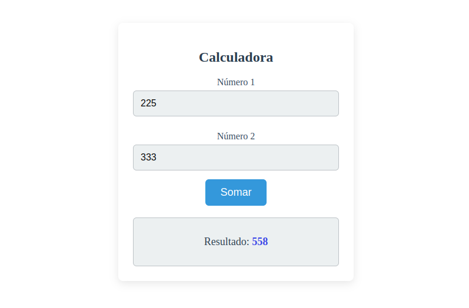

# Simple Sum Calculator

This project is a simple sum calculator that I developed to practice my development skills in Angular 19.



## Skills:
- Module export and import
- Components
- One-way and Two-way Data Binding
- Events
- Forms
- Conditional Rendering (@if / *ngIf)

---

This project was generated using [Angular CLI](https://github.com/angular/angular-cli) version 19.2.4.

## Development server

To start a local development server, run:

```bash
ng serve
```

Once the server is running, open your browser and navigate to `http://localhost:4200/`. The application will automatically reload whenever you modify any of the source files.
